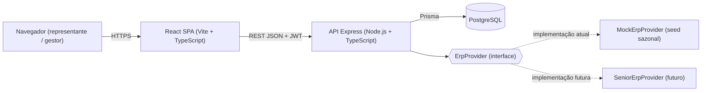
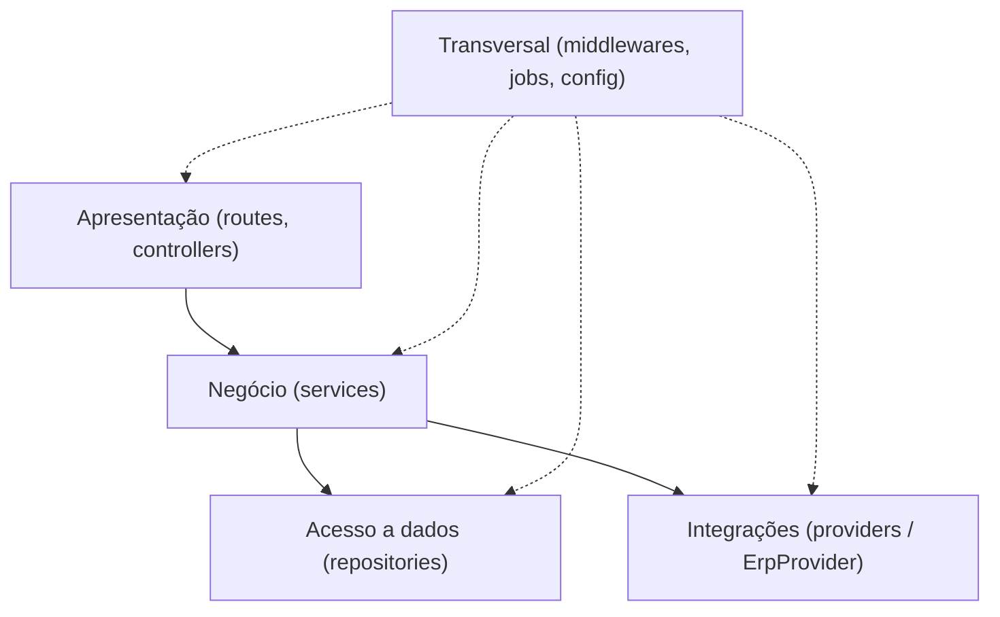

# ChokoCRM — Arquitetura e Decisões Técnicas

Este documento descreve a arquitetura do ChokoCRM e registra as decisões técnicas (ADRs). Complementa a [especificação técnica](especificacao-tecnica.md), que prevalece em caso de divergência.

Este documento registra a arquitetura do ChokoCRM e as decisões técnicas (ADRs) tomadas até a Etapa 1. Ele serve de referência para as etapas seguintes do cronograma (seção 11 da especificação técnica): toda implementação deve manter consistência com as decisões aqui registradas ou, quando necessário, propor um novo ADR justificando o desvio.

## Sumário

1. [Visão geral](#1-visão-geral)
2. [Estrutura de pastas](#2-estrutura-de-pastas)
3. [Decisões arquiteturais (ADRs)](#3-decisões-arquiteturais-adrs)
4. [API REST](#4-api-rest)
5. [Qualidade](#5-qualidade)

---

## 1. Visão geral

O ChokoCRM segue arquitetura em camadas — restrição definida pela disciplina e registrada em [ADR-001](#adr-001--stack-definido-pela-disciplina) — organizada em dois grandes blocos: um frontend em React consumido pelo navegador do representante ou do gestor, e um backend em Node.js/Express dividido internamente em quatro camadas (apresentação, negócio, acesso a dados, integrações) mais um eixo transversal de infraestrutura (autenticação, tratamento de erros, logs, jobs agendados e configuração). A persistência é feita em PostgreSQL via Prisma; dados de venda e estoque do ERP não são persistidos no ChokoCRM e são consultados sob demanda através de um provider substituível.

### 1.1 Diagrama de contêineres



O navegador carrega a SPA React, que consome exclusivamente a API REST do Express via JSON, autenticada por token JWT (seção 8 e [ADR-008](#adr-008--autenticação-jwt-com-papéis-representante-e-gestor)). A API é o único ponto de acesso ao PostgreSQL (via Prisma) e ao ERP: o acesso ao ERP nunca é feito diretamente pelo frontend, e sim através da interface `ErpProvider`, hoje implementada por `MockErpProvider` e futuramente substituível por `SeniorErpProvider` sem alterar as camadas superiores ([ADR-004](#adr-004--integração-erp-via-adapter-com-mockerpprovider)).

### 1.2 Diagrama de camadas do backend



O diagrama reproduz as regras de dependência da seção 4.1 da especificação técnica: uma camada superior só conhece a camada imediatamente inferior que ela invoca, nunca o inverso. A camada de **apresentação** (`routes` + `controllers`) recebe a requisição HTTP, valida a entrada (zod) e delega toda decisão à camada de **negócio** (`services`); os services não conhecem `req`/`res` do Express — não têm qualquer dependência da camada de apresentação. A partir do negócio, as duas camadas seguintes são acessadas em paralelo, cada uma isolada da outra: **acesso a dados** (`repositories`, via Prisma), que não contém regra de negócio (não decide, por exemplo, a cor do cliente — apenas lê e grava registros); e **integrações** (`providers`), acessada exclusivamente através da interface `ErpProvider` — nenhuma outra camada chama uma API de ERP diretamente. O eixo **transversal** (middlewares de autenticação JWT e tratamento de erros, jobs agendados via `node-cron`, configuração) dá suporte a todas as camadas sem carregar regra de negócio de domínio própria.

## 2. Estrutura de pastas

```
chokocrm/
├── backend/
│   ├── src/
│   │   ├── routes/            # definição das rotas REST por domínio
│   │   ├── controllers/       # req/res, validação (zod), status codes
│   │   ├── services/          # regra de negócio pura, testável
│   │   ├── repositories/      # acesso a dados via Prisma
│   │   ├── providers/
│   │   │   └── erp/           # ErpProvider (interface), MockErpProvider, (futuro) SeniorErpProvider
│   │   ├── middlewares/       # authJwt, errorHandler, requestLogger
│   │   ├── jobs/              # cron diário de alertas de visita
│   │   └── config/            # env, constantes (regras de cor, datas comemorativas)
│   └── prisma/                # schema.prisma, migrations, seed.ts
├── frontend/
│   └── src/
│       ├── pages/             # Login, Clientes, FichaCliente, CheckIn, Painel
│       ├── components/        # ColorBadge, ContactList, VisitTimeline, InsightCard
│       ├── services/          # cliente HTTP da API REST
│       └── hooks/
├── docs/                      # casos de uso, modelo de dados, arquitetura, ADRs
├── docker-compose.yml
├── .github/workflows/         # ci.yml (lint+test+build), deploy.yml
└── README.md
```

**Apresentação (`backend/src/routes`, `backend/src/controllers`).** As rotas mapeiam método HTTP + caminho para o controller correspondente, sem lógica própria além do roteamento. Os controllers leem a requisição, validam a entrada com zod, chamam o service apropriado e traduzem o resultado em corpo de resposta e status code. Essa camada **não** implementa regra de negócio, **não** acessa `repositories` ou o Prisma Client diretamente e **não** decide, por exemplo, qual cor atribuir a um cliente.

**Negócio (`backend/src/services`).** Concentra toda regra de negócio do domínio — classificação por cor, cálculo de próxima visita, geração de insights de BI, montagem de templates de mensagem, apuração de KPIs — como módulos independentes de Express, o que os torna fáceis de testar unitariamente (seção 10). Essa camada **não** conhece `req`/`res`, **não** monta consultas Prisma diretamente (delega a `repositories`) e **não** chama uma API HTTP de ERP diretamente (delega a `providers`).

**Acesso a dados (`backend/src/repositories`, `backend/prisma`).** Os repositories encapsulam todo o acesso ao PostgreSQL via Prisma Client (leitura, criação, atualização de `User`, `Client`, `Contact`, `Visit` etc.); `prisma/` guarda o schema, as migrations versionadas e o seed determinístico. Essa camada **não** contém regra de negócio — não decide, por exemplo, se uma alteração de recorrência exige justificativa; apenas persiste o que o service determinou.

**Integrações (`backend/src/providers/erp`).** Define a interface `ErpProvider` e sua implementação atual `MockErpProvider` (dados gerados por seed com sazonalidade realista), com espaço já reservado para a futura `SeniorErpProvider`. Essa camada **não** persiste dados de venda ou estoque no banco do ChokoCRM — apenas consulta sob demanda — e **não** é chamada diretamente por controllers ou repositories, somente pela camada de negócio.

**Transversal (`backend/src/middlewares`, `backend/src/jobs`, `backend/src/config`).** Os middlewares tratam autenticação JWT, formatação centralizada de erros e log estruturado de requisições; os jobs executam a rotina diária (`node-cron`) que materializa a agenda de visitas do dia/atrasadas; `config/` concentra variáveis de ambiente e constantes ajustáveis (limiares de cor, calendário de datas comemorativas). Essa camada **não** implementa regra de negócio específica de um caso de uso — fornece apenas infraestrutura compartilhada pelas demais camadas.

**Frontend (`frontend/src/pages`, `components`, `services`, `hooks`).** As `pages` compõem as telas completas do produto (Login, Clientes, FichaCliente, CheckIn, Painel), reaproveitando `components` de UI reutilizáveis (`ColorBadge`, `ContactList`, `VisitTimeline`, `InsightCard`). A camada `services` do frontend concentra o cliente HTTP da API REST (incluindo o envio do token JWT); os `hooks` encapsulam estado de servidor (TanStack Query) e lógica reativa compartilhada entre páginas. O frontend **não** reimplementa regra de negócio de domínio — cor, recorrência e insights são sempre calculados pelo backend — e os `components` **não** fazem chamada HTTP direta, apenas recebem dados via propriedades.

**Documentação e infraestrutura (`docs/`, `docker-compose.yml`, `.github/workflows/`, `README.md`).** `docs/` concentra a documentação viva do projeto (casos de uso, modelo de dados, esta arquitetura, protótipo navegável); `docker-compose.yml` sobe o ambiente local completo (Postgres + API + Web); `.github/workflows/` contém os pipelines de integração contínua (`ci.yml`) e de deploy (`deploy.yml`); `README.md` documenta o setup do projeto. Nenhum desses arquivos contém regra de negócio do domínio do CRM.

## 3. Decisões arquiteturais (ADRs)

As decisões abaixo formam a lista fechada de ADRs da Etapa 1 e serão referenciadas pelas etapas seguintes do cronograma (seção 11 da especificação técnica) sempre que uma decisão for revisitada, detalhada ou, excepcionalmente, revista.

### ADR-001 — Stack definido pela disciplina

**Contexto.** A disciplina PAC exige que o projeto adote arquitetura em camadas, frontend em React, backend em Node.js + Express, comunicação via API REST e PostgreSQL como banco de dados (seção 3 da especificação técnica), como critério de avaliação e para uniformizar os projetos da turma. Essa definição antecede qualquer decisão de design da equipe.

**Decisão.** Adotar integralmente o stack exigido pelo professor — React (+ Vite + TypeScript) no frontend, Node.js + Express (+ TypeScript) no backend, comunicação por API REST e PostgreSQL como SGBD — registrando-o aqui como **restrição externa**, não como escolha de engenharia da equipe.

**Consequências.** As decisões seguintes (ORM, autenticação, testes, deploy) precisam ser compatíveis com esse stack; não há espaço de decisão sobre linguagem ou framework nesse nível. O esforço de design da equipe se concentra na organização interna em camadas, nas integrações e nas regras de negócio.

### ADR-002 — Monorepo público único no GitHub

**Contexto.** O cronograma da disciplina (seção 11) prevê entregas incrementais de backend, frontend e documentação nas mesmas datas, avaliadas a partir de um repositório público no GitHub (seção 3). Manter repositórios separados aumentaria o custo de coordenação de versões e dificultaria a avaliação pela banca.

**Decisão.** Manter um único repositório público no GitHub (`chokocrm`), contendo backend, frontend, documentação e infraestrutura (Docker Compose, workflows de CI/CD), seguindo a estrutura de pastas da seção 2 deste documento.

**Consequências.** O histórico de commits e o versionamento ficam centralizados, simplificando a revisão pela banca. Em contrapartida, exige convenção clara de pastas (`backend/`, `frontend/`, `docs/`) para não misturar responsabilidades, e os pipelines de CI precisam, à medida que o projeto crescer, filtrar por diretório alterado para evitar builds desnecessários.

### ADR-003 — Prisma como ORM

**Contexto.** O banco de dados é PostgreSQL (restrição da disciplina). A camada de acesso a dados precisa de migrations versionadas, tipos alinhados ao TypeScript do backend e baixo atrito de configuração, dado o prazo curto de um projeto acadêmico.

**Decisão.** Adotar Prisma como ORM, com `schema.prisma` como fonte única do modelo de dados, migrations versionadas em `prisma/migrations` e seed determinístico em `prisma/seed.ts`.

**Consequências.** Ganha-se type-safety entre o modelo de dados e o código do backend, migrations reproduzíveis entre ambientes (desenvolvimento, CI, produção) e geração automática de um client tipado. Introduz-se acoplamento ao Prisma Client, mitigado por mantê-lo isolado na camada de `repositories`, sem vazar para `services`; exige também que a equipe aprenda a linguagem de schema do Prisma.

### ADR-004 — Integração ERP via Adapter com MockErpProvider

**Contexto.** O ChokoCRM deve futuramente integrar com o ERP da Senior Sistemas, mas essa API não está disponível durante o período da disciplina (seções 1 e 12). O cronograma (etapa 5, seção 11) já prevê que a integração comece simulada.

**Decisão.** Definir a interface `ErpProvider` (seção 4.3 da especificação técnica), desacoplada de qualquer implementação concreta, com `MockErpProvider` como implementação inicial — dados gerados por seed com sazonalidade realista — consumida apenas pela camada de negócio.

**Consequências.** A troca futura pela API real da Senior consiste em implementar uma nova classe (`SeniorErpProvider`) que satisfaça a mesma interface, sem alterar controllers, services (além da instância injetada) ou repositories. O módulo de BI pode ser desenvolvido e testado desde já com dados determinísticos. Existe o risco de o mock não reproduzir todas as particularidades da API real, o que pode exigir ajustes na etapa 5.

### ADR-005 — Mensagem de estoque via link wa.me

**Contexto.** O envio automático de mensagens pela API oficial do WhatsApp (Meta) exige aprovação de conta comercial e tem custo por mensagem, inviável para o escopo e o prazo da disciplina (seção 12). Ainda assim, o representante precisa de um jeito ágil de consultar o cliente sobre reposição de estoque em campo.

**Decisão.** Gerar um link `https://wa.me/<telefone>?text=<mensagem>` com texto pré-preenchido a partir de templates (produtos sugeridos do `SeasonalEvent` vigente), deixando o envio efetivo a cargo do próprio WhatsApp do representante. Cada geração é registrada em `StockMessage`.

**Consequências.** Não há dependência de API paga nem de aprovação externa, e o recurso funciona em campo sem infraestrutura adicional. O representante mantém controle total sobre o que e quando enviar, podendo revisar o texto antes de enviar. Em contrapartida, o sistema não tem confirmação de entrega ou leitura, e o registro em `StockMessage` reflete apenas a geração da mensagem, não o envio efetivo.

### ADR-006 — Classificação por cor calculada em tempo de consulta

**Contexto.** A cor do cliente depende de valores que mudam a cada nova visita ou a cada dia que passa sem visita (seção 6.1). Armazenar a cor como campo persistido exigiria um job de recomputação periódica e criaria risco de inconsistência entre o evento (nova visita) e a atualização do campo.

**Decisão.** Calcular a cor sob demanda, em tempo de consulta, a partir dos limiares fixos de dias sem visita (15/30, configuráveis em `config/`) aplicados à última `Visit` (e ao campo `houve_venda`) — não a partir de `Client.recorrencia_dias`, que alimenta apenas a agenda e os lembretes de próxima visita (seção 6.2) —, e, a partir da etapa 5, também da última venda via `ErpProvider`, sem persistir o valor no banco.

**Consequências.** A cor exibida está sempre consistente com o estado real de visitas e vendas, sem necessidade de jobs de sincronização. O cálculo, sendo uma função pura na camada de negócio, é trivial de testar unitariamente (seção 10). Em contrapartida, listagens com filtro por cor precisam calcular a cor de cada cliente na própria consulta, o que pode exigir índices em `Visit.data_hora` e paginação caso o volume de clientes cresça.

### ADR-007 — Docker Compose no desenvolvimento; Railway/Render em produção

**Contexto.** O PAC exige nuvem pública e estável para a avaliação final (seção 12), e a equipe precisa de um ambiente local reprodutível para desenvolvimento e CI, incluindo o PostgreSQL.

**Decisão.** Usar Docker Compose (Postgres + API + Web) para desenvolvimento local e CI, e publicar o deploy de produção no Railway ou Render a partir da branch `main` via GitHub, mantendo o ambiente congelado antes da avaliação final.

**Consequências.** Onboarding e execução local ficam padronizados (`docker-compose up`), com paridade razoável entre desenvolvimento e produção. A escolha final entre Railway e Render fica em aberto até a etapa 6, sem impacto nas camadas de aplicação, já que ambas as plataformas suportam Node.js e Postgres via variáveis de ambiente. Exige atenção ao congelamento do deploy perto da apresentação, conforme risco já mapeado na seção 12.

### ADR-008 — Autenticação JWT com papéis REPRESENTANTE e GESTOR

**Contexto.** O sistema tem dois perfis de uso com permissões distintas — representante (uso em campo: clientes, visitas, mensagens de estoque) e gestor (painel de indicadores, alertas) — e a API REST precisa de um mecanismo de autenticação sem estado no servidor, compatível com múltiplos clientes (a SPA atual e, futuramente, um app nativo).

**Decisão.** Autenticar via JSON Web Token emitido em `POST /auth/login`, carregando o papel do usuário (`REPRESENTANTE` | `GESTOR`); a autorização por rota é feita em um middleware que verifica o token e o papel antes de a requisição chegar ao controller.

**Consequências.** A API fica sem estado no servidor (stateless), simplificando escalabilidade horizontal. Um middleware central de autenticação evita duplicar a checagem de permissão em cada controller. Fica em aberto, para detalhamento na etapa 2, a estratégia de expiração e renovação do token, além do cuidado necessário com o armazenamento do token no frontend para mitigar risco de XSS.

## 4. API REST

Contorno de rotas (seção 7 da especificação técnica):

```
POST   /auth/login
GET    /clients?color=&search=          GET    /clients/:id
POST   /clients                         PUT    /clients/:id
POST   /clients/:id/contacts            PUT/DELETE /contacts/:id
POST   /clients/:id/visits              GET    /clients/:id/visits
PUT    /clients/:id/recurrence          (exige justificativa)
GET    /clients/:id/erp                 (última venda, volume, estoque — via provider)
POST   /clients/:id/stock-message       GET    /stock-messages
GET    /insights                        GET    /insights/manager-alerts
GET    /dashboard/kpis                  GET    /agenda/today
GET    /health
```

Descrição por grupo:

- **Autenticação** (`POST /auth/login`) — emite o token JWT a partir de credenciais válidas.
- **Clientes** (`GET/POST/PUT /clients`, `GET /clients/:id`) — listagem com busca e filtro por cor, cadastro e edição dos dados cadastrais do cliente.
- **Contatos** (`POST /clients/:id/contacts`, `PUT/DELETE /contacts/:id`) — cadastro, edição e remoção dos contatos de um cliente.
- **Visitas** (`POST/GET /clients/:id/visits`) — registro de check-in (descrição obrigatória) e histórico de visitas do cliente.
- **Recorrência** (`PUT /clients/:id/recurrence`) — altera a frequência de visita do cliente, exigindo justificativa registrada.
- **ERP** (`GET /clients/:id/erp`) — expõe última venda, volume de compras e histórico de estoque, consultados via `ErpProvider`.
- **Mensagem de estoque** (`POST /clients/:id/stock-message`, `GET /stock-messages`) — gera o link `wa.me` pré-preenchido e mantém o histórico de mensagens geradas.
- **Insights** (`GET /insights`, `GET /insights/manager-alerts`) — sugestões de BI ao representante e alertas de estoque/demanda ao gestor.
- **Painel e agenda** (`GET /dashboard/kpis`, `GET /agenda/today`) — indicadores gerenciais e lista de visitas do dia por representante.
- **Saúde** (`GET /health`) — verificação de disponibilidade da API e da conexão com o banco.

Erros são padronizados no formato `{ error: { code, message, details? } }`, produzidos por um middleware central de tratamento de erros; a validação de entrada é feita com zod nos controllers; respostas `401`/`403` são resolvidas pelo middleware de autenticação JWT combinado à verificação de papel do usuário.

## 5. Qualidade

### 5.1 Testes

- **Unitários (Jest)** sobre a camada de negócio (`services`): regra de classificação por cor, cálculo de próxima visita, geração de insights e montagem de templates de mensagem — funções puras, sem dependência de Express ou de banco, portanto simples de testar isoladamente.
- **Integração (Supertest + Postgres de teste)** sobre rotas críticas: autenticação, CRUD de clientes, check-in de visita (validação de descrição obrigatória) e alteração de recorrência (validação de justificativa obrigatória).
- **Seed determinístico** para o `MockErpProvider`, permitindo asserções estáveis sobre o módulo de BI mesmo com dados sazonais simulados.
- Cada módulo entregue em uma etapa do cronograma (seção 11) inclui seus testes correspondentes, conforme exigência transversal da especificação técnica.

### 5.2 Observabilidade e operação

- **Ambientes:** desenvolvimento local via Docker Compose (Postgres + API com hot reload + Web) e produção na nuvem (Railway ou Render), com variáveis de ambiente via `.env` (`.env.example` versionado).
- **CI (GitHub Actions):** lint (ESLint), testes e build a cada push/PR; **CD** publica a branch `main` em produção.
- **Logs estruturados** (pino) com identificador de requisição (request-id), facilitando o rastreio de erros em produção.
- O endpoint `GET /health` verifica a disponibilidade da API e a conexão com o banco de dados.
- **Sentry** (free tier) captura erros em produção; um monitor externo de uptime (UptimeRobot) é ativado antes da apresentação final, mantendo o ambiente estável conforme exigência do PAC.
