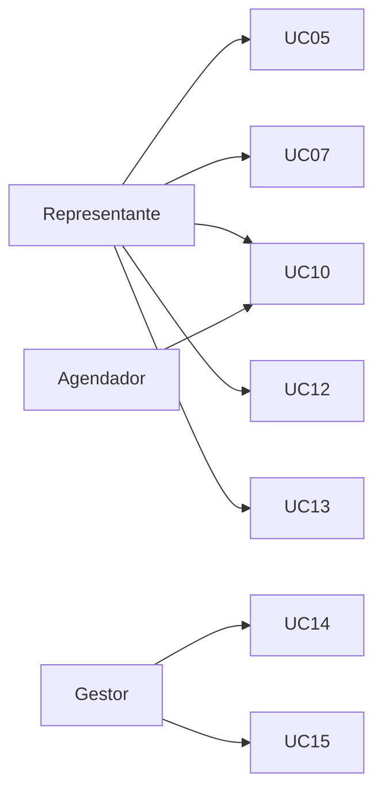

# ChokoCRM — Casos de Uso

Este documento descreve os casos de uso do ChokoCRM. Complementa a [especificação técnica](especificacao-tecnica.md), que prevalece em caso de divergência.

---

## 1. Introdução e escopo

Este documento especifica os casos de uso do ChokoCRM, cobrindo os fluxos de cadastro e gestão de clientes, registro de visitas, classificação por cores, cruzamento com dados de ERP, geração de mensagens de consulta de estoque, insights de sazonalidade e indicadores gerenciais, conforme descrito nos objetivos do produto e nas regras de negócio da especificação técnica (seções 2 e 6).

Os identificadores **UC01 a UC15** definidos aqui são referenciados pelo protótipo navegável (`docs/prototipo/`) e pela matriz de rastreabilidade das etapas 2 a 6 do cronograma da disciplina.

## 2. Atores

| Ator | Tipo | Descrição |
|---|---|---|
| **Representante Comercial** | Principal, humano | Usuário de campo. Cadastra e mantém clientes, realiza check-ins de visita, consulta agenda, histórico, dados de ERP e insights. |
| **Gestor** | Principal, humano | Acompanha KPIs de vendas e visitas e recebe alertas de produção. Possui, adicionalmente, todas as permissões do Representante Comercial. |
| **Sistema (Agendador)** | Secundário, automatizado | Processo executado diariamente (job agendado, sem intervenção humana) que recalcula e materializa a lista de visitas previstas e atrasadas por representante. |

**Observação sobre sobreposição de permissões:** por herdar todas as permissões do Representante Comercial, o Gestor pode executar também os casos de uso UC01–UC13 quando necessário. O diagrama de visão geral (seção 3) e as fichas individuais (seção 4) indicam o ator tipicamente responsável por cada fluxo no uso cotidiano do sistema, não uma restrição de acesso adicional além do controle de papel (role) já previsto em UC01.

## 3. Diagrama de visão geral

O diagrama acima destaca, de forma simplificada, os fluxos centrais de cada ator no uso cotidiano do sistema. A tabela a seguir complementa a visão geral, associando **todos** os 15 casos de uso ao(s) ator(es) principal(is), para fins de rastreabilidade:

| UC | Nome | Ator(es) |
|---|---|---|
| UC01 | Autenticar no sistema | Representante, Gestor |
| UC02 | Cadastrar cliente | Representante |
| UC03 | Editar e inativar cliente | Representante |
| UC04 | Gerenciar contatos do cliente | Representante |
| UC05 | Visualizar lista de clientes com classificação por cores | Representante |
| UC06 | Visualizar ficha do cliente | Representante |
| UC07 | Realizar check-in de visita | Representante |
| UC08 | Consultar histórico de interações | Representante |
| UC09 | Ajustar recorrência de visitas | Representante |
| UC10 | Visualizar agenda do dia | Representante; Sistema (Agendador) |
| UC11 | Consultar dados de venda/estoque do cliente | Representante |
| UC12 | Gerar mensagem de consulta de estoque | Representante |
| UC13 | Visualizar insights e sugestões | Representante |
| UC14 | Visualizar painel de KPIs (Gestor) | Gestor |
| UC15 | Receber alertas de produção (Gestor) | Gestor |

## 4. Especificação dos casos de uso

Cada caso de uso é descrito com: identificador e nome, ator principal (e secundário, quando houver), pré-condições, fluxo principal numerado, fluxos alternativos e/ou de exceção (identificados como A*n* e E*n*, referenciando o passo do fluxo principal em que ocorrem) e regras de negócio associadas.

---

### UC01 — Autenticar no sistema

**Ator principal:** Representante Comercial e Gestor.

**Pré-condições:** o ator possui conta previamente cadastrada no sistema (usuário com e-mail, senha e papel definidos).

**Fluxo principal:**
1. O ator acessa a tela de login.
2. O ator informa e-mail e senha.
3. O sistema valida as credenciais informadas.
4. O sistema emite um token JWT contendo o identificador do usuário e o seu papel (Representante ou Gestor).
5. O sistema redireciona o ator para a tela inicial correspondente ao seu papel.

**Fluxo de exceção:**
- **E1** (passo 3): credenciais inválidas — o sistema exibe mensagem de erro, mantém o ator na tela de login e não emite token.

**Regras de negócio associadas:**
- Autenticação por e-mail e senha, com emissão de token JWT no login.
- Toda rota subsequente da API exige token válido; o papel do usuário (Representante ou Gestor) determina o acesso a funcionalidades restritas (ex.: UC14 e UC15).

---

### UC02 — Cadastrar cliente

**Ator principal:** Representante Comercial.

**Pré-condições:** o representante está autenticado (UC01).

**Fluxo principal:**
1. O representante seleciona a opção "novo cliente".
2. O sistema apresenta o formulário de cadastro.
3. O representante informa razão social, nome fantasia, CNPJ, cidade, endereço, telefone, e-mail e, quando já disponível, o identificador do cliente no ERP.
4. O representante informa ao menos um contato do cliente, marcando-o como principal (ver UC04).
5. O sistema atribui a recorrência de visitas padrão de 15 dias, ajustável posteriormente (ver UC09).
6. O representante confirma o cadastro.
7. O sistema valida os dados informados.
8. O sistema persiste o cliente com status ativo e exibe a ficha do cliente recém-criado (UC06).

**Fluxo de exceção:**
- **E1** (passo 7): dados obrigatórios ausentes ou inválidos (ex.: CNPJ mal formatado, nenhum contato marcado como principal) — o sistema bloqueia o salvamento e sinaliza os campos pendentes ou inválidos.

**Regras de negócio associadas:**
- Cadastro exige, no mínimo: razão social, nome fantasia, CNPJ, cidade, endereço, telefone e e-mail.
- O identificador do cliente no ERP é **opcional** no cadastro — seu preenchimento é recomendado assim que disponível, mas a ausência não impede o cadastro do cliente. Sem esse identificador, a consulta de dados de venda/estoque (UC11) fica indisponível para o cliente até que o campo seja preenchido (ver fluxo de exceção de UC11).
- Recorrência de visitas padrão de 15 dias na criação do cliente.
- Cadastro exige ao menos um contato principal (ver UC04).

---

### UC03 — Editar e inativar cliente

**Ator principal:** Representante Comercial.

**Pré-condições:** o cliente já está cadastrado no sistema.

**Fluxo principal (edição):**
1. O representante acessa a ficha do cliente (UC06) e seleciona "editar".
2. O sistema apresenta os dados atuais do cliente em formulário editável.
3. O representante altera os campos desejados.
4. O representante confirma a alteração.
5. O sistema valida e persiste as mudanças.

**Fluxo alternativo:**
- **A1** (a partir do passo 1): inativação do cliente.
  1. O representante seleciona "inativar cliente" na ficha do cliente.
  2. O sistema solicita confirmação da inativação.
  3. O representante confirma.
  4. O sistema marca o cliente com a flag `ativo = false` (inativação lógica).
  5. O cliente deixa de aparecer nas listagens padrão (UC05), mas seu cadastro, contatos e histórico de visitas permanecem preservados e consultáveis.

**Fluxo de exceção:**
- **E1** (passo 5 do fluxo principal): dados inválidos informados na edição — o sistema bloqueia o salvamento e sinaliza os campos pendentes ou inválidos.

**Regras de negócio associadas:**
- A inativação de cliente é sempre lógica, por meio da flag `ativo`; não há, em nenhum fluxo do sistema, exclusão física do registro do cliente.

---

### UC04 — Gerenciar contatos do cliente

**Ator principal:** Representante Comercial.

**Pré-condições:** o cliente já está cadastrado no sistema.

**Fluxo principal:**
1. O representante acessa a seção de contatos na ficha do cliente (UC06).
2. O representante adiciona um novo contato, informando nome, cargo, telefone e e-mail.
3. O sistema persiste o contato associado ao cliente.
4. O representante marca um dos contatos do cliente como principal.
5. O sistema garante que exatamente um contato permaneça marcado como principal, desmarcando automaticamente qualquer outro contato anteriormente definido como tal.

**Fluxos alternativos:**
- **A1** (a partir do passo 1): edição de um contato existente — o representante altera os dados do contato e o sistema persiste a alteração.
- **A2** (a partir do passo 1): remoção de um contato existente que não seja o principal — o sistema remove o contato normalmente.

**Fluxo de exceção:**
- **E1** (variação do passo 2): tentativa de remover o único contato marcado como principal sem antes designar outro contato como principal — o sistema bloqueia a remoção e solicita a definição de um novo contato principal antes de prosseguir.

**Regras de negócio associadas:**
- O cliente pode ter múltiplos contatos (nome, cargo, telefone, e-mail).
- Exatamente um contato deve estar marcado como principal a qualquer momento.

---

### UC05 — Visualizar lista de clientes com classificação por cores

**Ator principal:** Representante Comercial.

**Pré-condições:** o representante está autenticado; existem clientes cadastrados.

**Fluxo principal:**
1. O representante acessa a lista de clientes.
2. O sistema calcula, para cada cliente ativo, a cor de classificação em tempo de consulta, conforme a tabela de regras abaixo.
3. O sistema exibe a lista com nome, cidade e selo (badge) de cor de cada cliente.
4. O representante busca por nome ou cidade.
5. O representante filtra por cor.
6. O sistema atualiza a lista conforme os critérios de busca e filtro aplicados.

**Fluxo alternativo:**
- **A1** (passos 4–5): nenhum cliente corresponde aos critérios de busca ou filtro informados — o sistema exibe lista vazia com mensagem informativa.

**Regras de negócio associadas — classificação por cores:**

| Cor | Critério |
|---|---|
| 🟢 Verde | Última visita ≤ 15 dias, **com** venda |
| 🟡 Amarelo | Última visita ≤ 15 dias, **sem** venda |
| 🟠 Laranja | Entre 15 e 30 dias sem visita |
| 🔴 Vermelho | Mais de 30 dias sem visita |

- A cor do cliente é **calculada em tempo de consulta**, nunca armazenada.
- Clientes inativos (UC03) não aparecem na listagem padrão.
- **Evolução da regra na Etapa 5:** a partir da integração com o provedor de ERP (ver UC11), a classificação por cor passa a ser **composta**: além do tempo sem visita, também considera a data da última venda do cliente obtida do ERP. Um cliente visitado recentemente, porém sem venda registrada há um período prolongado, é **rebaixado** na classificação (deixa de ser classificado como verde/amarelo apenas por ter sido visitado). Os limiares dessa regra composta permanecem configuráveis, para ajuste fino junto à empresa.

---

### UC06 — Visualizar ficha do cliente

**Ator principal:** Representante Comercial.

**Pré-condições:** o cliente está cadastrado no sistema.

**Fluxo principal:**
1. O representante seleciona um cliente na lista (UC05) ou na agenda do dia (UC10).
2. O sistema exibe os dados cadastrais do cliente, incluindo a cor de classificação atual (UC05).
3. O sistema exibe os contatos do cliente (UC04).
4. O sistema exibe a timeline de visitas em ordem cronológica reversa (UC08).
5. O sistema exibe os dados de venda e estoque obtidos do ERP (UC11).
6. O sistema exibe os insights e sugestões relacionados ao cliente (UC13).

**Fluxo de exceção:**
- **E1** (passo 5): dados do ERP indisponíveis (ex.: provedor fora do ar) — o sistema exibe a seção correspondente com mensagem de indisponibilidade, sem impedir a visualização do restante da ficha.

**Regras de negócio associadas:**
- A ficha do cliente consolida dados próprios do cliente e informações provenientes de UC04 (contatos), UC08 (histórico), UC11 (ERP) e UC13 (insights).
- Este caso de uso é **evolutivo**: a seção de contatos e dados básicos é entregue na Etapa 2, a timeline de visitas na Etapa 3, a cor de classificação na Etapa 4, a seção de ERP na Etapa 5 e a seção de insights na Etapa 6.

---

### UC07 — Realizar check-in de visita

**Ator principal:** Representante Comercial.

**Pré-condições:** o cliente está cadastrado; o representante está autenticado.

**Fluxo principal:**
1. O representante acessa "novo check-in" a partir da ficha do cliente (UC06) ou da agenda do dia (UC10).
2. O sistema preenche automaticamente a data e a hora atuais.
3. O representante pode ajustar manualmente a data/hora, se necessário.
4. O representante informa a descrição da visita.
5. O representante indica se houve venda (sim/não).
6. O representante pode selecionar o contato atendido, de forma opcional.
7. O representante confirma o check-in.
8. O sistema valida os dados informados.
9. O sistema persiste a visita e atualiza a timeline de interações (UC08) e a cor de classificação do cliente (UC05), agora recalculada.

**Fluxo de exceção:**
- **E1** (passo 8): tentativa de salvar o check-in sem informar a descrição da visita — o sistema bloqueia o salvamento e exibe mensagem indicando que a descrição é obrigatória.

**Regras de negócio associadas:**
- A descrição da visita é **obrigatória**, com validação tanto no frontend quanto no backend.
- O campo "houve venda?" (sim/não) é obrigatório.
- O contato atendido é opcional.
- A data/hora é preenchida automaticamente no momento do check-in, mas admite ajuste manual pelo representante (ex.: registro posterior de uma visita já ocorrida).

---

### UC08 — Consultar histórico de interações

**Ator principal:** Representante Comercial.

**Pré-condições:** o cliente está cadastrado no sistema.

**Fluxo principal:**
1. O representante acessa a timeline de visitas na ficha do cliente (UC06).
2. O sistema lista as visitas do cliente em ordem cronológica reversa (mais recente primeiro).
3. Para cada visita, o sistema exibe data, hora, descrição, contato atendido (quando informado) e se houve venda.

**Fluxo alternativo:**
- **A1** (passo 2): o cliente não possui visitas registradas — o sistema exibe mensagem informando que não há visitas registradas.

**Regras de negócio associadas:**
- A listagem segue sempre ordenação cronológica reversa.
- Todos os campos da visita (data/hora, descrição, contato, houve venda) são exibidos integralmente.

---

### UC09 — Ajustar recorrência de visitas

**Ator principal:** Representante Comercial.

**Pré-condições:** o cliente está cadastrado no sistema.

**Fluxo principal:**
1. O representante acessa a opção de ajuste de recorrência na ficha do cliente (UC06).
2. O sistema exibe a recorrência atual, em dias, informando a faixa sugerida de 15 a 30 dias.
3. O representante informa o novo valor de recorrência.
4. O representante informa a justificativa da alteração.
5. O representante confirma a alteração.
6. O sistema valida os dados informados.
7. O sistema grava a alteração em histórico (quem alterou, quando, valor anterior, novo valor e justificativa).
8. O sistema atualiza a recorrência vigente do cliente.

**Fluxo alternativo:**
- **A1** (passo 3): o valor informado está fora da faixa sugerida (15–30 dias) — o sistema exibe um alerta informando que o valor foge da faixa recomendada; o representante pode prosseguir mesmo assim, mediante confirmação, respeitada a exigência de justificativa (passo 4).

**Fluxo de exceção:**
- **E1** (passo 6): justificativa não informada — o sistema bloqueia a alteração e exibe mensagem indicando que a justificativa é obrigatória.

**Regras de negócio associadas:**
- Faixa sugerida de recorrência: 15 a 30 dias.
- Toda alteração de recorrência exige justificativa registrada.
- Toda alteração é gravada em histórico auditável, contendo quem alterou, quando, o valor anterior, o novo valor e a justificativa.

---

### UC10 — Visualizar agenda do dia

**Ator principal:** Representante Comercial. **Ator secundário:** Sistema (Agendador).

**Pré-condições:** existem clientes cadastrados com recorrência de visitas definida.

**Fluxo principal:**
1. O Sistema (Agendador) executa diariamente, por meio de um job agendado, o cálculo das visitas previstas para o dia (data da última visita + recorrência do cliente) e das visitas atrasadas, por representante.
2. O representante acessa a tela "Agenda do dia".
3. O sistema apresenta a lista de clientes com visita prevista para hoje e os clientes com visita atrasada, priorizados pela cor de classificação do cliente (vermelho e laranja com prioridade sobre amarelo e verde).
4. O representante seleciona um cliente da agenda para acessar sua ficha (UC06) ou registrar um check-in (UC07).

**Fluxo alternativo:**
- **A1** (passo 3): não há visitas previstas ou atrasadas para o representante no dia — o sistema exibe a agenda vazia, com mensagem informativa.

**Regras de negócio associadas:**
- Próxima visita prevista = data da última visita + recorrência (em dias) do cliente.
- Um job diário (executado pelo Sistema/Agendador) materializa a lista de visitas do dia e das atrasadas, por representante.
- A priorização da lista segue a cor de classificação do cliente (UC05).

---

### UC11 — Consultar dados de venda/estoque do cliente

**Ator principal:** Representante Comercial.

**Pré-condições:** o cliente possui identificador de ERP cadastrado (campo opcional em UC02; ver fluxo de exceção caso não tenha sido preenchido).

**Fluxo principal:**
1. O representante acessa a seção de dados de ERP na ficha do cliente (UC06).
2. O sistema consulta o provedor de ERP (provedor simulado, enquanto a integração real não estiver disponível) utilizando o identificador de ERP do cliente.
3. O sistema exibe a última venda, o volume de compras do período e o histórico de estoque do cliente.
4. O sistema exibe um aviso informando que os dados apresentados são simulados, enquanto o provedor simulado estiver em uso.

**Fluxo de exceção:**
- **E1** (passo 2): provedor de ERP indisponível, ou cliente sem identificador de ERP cadastrado (campo opcional em UC02) — o sistema exibe mensagem informando a indisponibilidade dos dados, sem impedir a visualização do restante da ficha do cliente.

**Regras de negócio associadas:**
- O acesso a dados de ERP é sempre realizado por meio de uma interface de integração (provedor de ERP), permitindo a substituição futura do provedor simulado pela integração real sem alterar as demais camadas do sistema.
- Os dados de venda e estoque não são persistidos no banco do ChokoCRM; são consultados sob demanda a cada acesso.
- Enquanto o provedor simulado estiver em uso, é obrigatória a exibição do aviso "dados simulados".
- **A partir da Etapa 5**, a última venda consultada aqui alimenta a regra de classificação por cor composta descrita em UC05: clientes visitados recentemente mas sem venda registrada há período prolongado são rebaixados na classificação.

---

### UC12 — Gerar mensagem de consulta de estoque

**Ator principal:** Representante Comercial.

**Pré-condições:** o cliente está cadastrado no sistema.

**Fluxo principal:**
1. O representante acessa "gerar mensagem de estoque" na ficha do cliente (UC06).
2. O sistema identifica o evento sazonal vigente, quando houver, e seus produtos sugeridos.
3. O sistema preenche o template de mensagem com os produtos sugeridos do evento sazonal vigente.
4. O representante revisa o texto da mensagem gerada.
5. O representante confirma a geração.
6. O sistema monta um link `wa.me` contendo o telefone do cliente/contato e o texto da mensagem.
7. O sistema registra a geração (data, cliente e usuário responsável).
8. O representante utiliza o link gerado para enviar a mensagem pelo próprio WhatsApp.

**Fluxo alternativo:**
- **A1** (passo 2): não há evento sazonal vigente — o sistema utiliza um template genérico, sem produtos sazonais específicos.

**Regras de negócio associadas:**
- A mensagem é enviada por meio de um link `wa.me` com texto pré-preenchido; o próprio representante revisa e envia pelo WhatsApp, sem envio automático via API.
- Toda geração de mensagem é registrada, para fins de auditoria e de cálculo da taxa de registro (KPI).

---

### UC13 — Visualizar insights e sugestões

**Ator principal:** Representante Comercial.

**Pré-condições:** o cliente possui histórico de vendas disponível via ERP.

**Fluxo principal:**
1. O representante acessa a seção de insights na ficha do cliente (UC06).
2. O sistema cruza os dados de vendas obtidos do provedor de ERP com os eventos sazonais cadastrados e o calendário vigente.
3. O sistema calcula sugestões acionáveis para o cliente, considerando a proximidade de datas comemorativas e o histórico de compras do cliente no mesmo período do ano anterior.
4. O sistema exibe as sugestões geradas (ex.: "Páscoa em N dias — cliente comprou X% a mais no período anterior").

**Fluxo alternativo:**
- **A1** (passo 3): dados insuficientes para gerar uma sugestão para determinado evento sazonal (ex.: sem histórico de compras no período correspondente) — o sistema não exibe sugestão para aquele evento, sem gerar erro.

**Regras de negócio associadas:**
- As sugestões são baseadas no cruzamento entre vendas do cliente, eventos sazonais e calendário.
- As sugestões são acionáveis, indicando ações como aumentar oferta, ofertar desconto ou criar promoção.

---

### UC14 — Visualizar painel de KPIs (Gestor)

**Ator principal:** Gestor.

**Pré-condições:** o gestor está autenticado (UC01).

**Fluxo principal:**
1. O gestor acessa o painel de indicadores.
2. O gestor seleciona, opcionalmente, um filtro de período ou época do ano.
3. O sistema calcula e exibe os indicadores: frequência de visitas, taxa de registro, conversão em vendas e clientes inativos por cor.
4. O gestor altera o filtro e o sistema recalcula e exibe os indicadores atualizados.

**Fluxo alternativo:**
- **A1** (passo 3): não há dados suficientes no período selecionado — o sistema exibe os indicadores zerados, com mensagem informativa.

**Regras de negócio associadas:**
- Os indicadores exibidos são: frequência de visitas, taxa de registro (de check-ins e de mensagens de estoque geradas), conversão em vendas e clientes inativos por cor.
- O painel admite filtro por período e por época do ano (sazonalidade).

---

### UC15 — Receber alertas de produção (Gestor)

**Ator principal:** Gestor.

**Pré-condições:** o gestor está autenticado; existem dados de estoque disponíveis via ERP e eventos sazonais cadastrados.

**Fluxo principal:**
1. O gestor acessa a seção de alertas de produção.
2. O sistema cruza, para os clientes ativos, os dados de estoque baixo obtidos do provedor de ERP com a demanda sazonal prevista (evento sazonal vigente ou próximo).
3. O sistema identifica as ocorrências em que estoque baixo coincide com alta demanda sazonal prevista.
4. O sistema exibe os alertas gerados, indicando cliente, produto e evento sazonal relacionado.

**Fluxo alternativo:**
- **A1** (passo 3): nenhuma coincidência identificada no período analisado — o sistema informa que não há alertas de produção no momento.

**Regras de negócio associadas:**
- Um alerta é sinalizado quando estoque baixo coincide com alta demanda sazonal prevista.
- Os alertas de produção são direcionados exclusivamente ao Gestor, para apoiar decisões de ajuste de produção.

---

## 5. Matriz de rastreabilidade (UC × Etapa de entrega)

| UC | Nome | Etapa de entrega |
|---|---|---|
| UC01 | Autenticar no sistema | Etapa 2 |
| UC02 | Cadastrar cliente | Etapa 2 |
| UC03 | Editar e inativar cliente | Etapa 2 |
| UC04 | Gerenciar contatos do cliente | Etapa 2 |
| UC05 | Visualizar lista de clientes com classificação por cores | Etapa 4 |
| UC06 | Visualizar ficha do cliente | Etapas 2 a 6 (evolutivo) |
| UC07 | Realizar check-in de visita | Etapa 3 |
| UC08 | Consultar histórico de interações | Etapa 3 |
| UC09 | Ajustar recorrência de visitas | Etapa 4 |
| UC10 | Visualizar agenda do dia | Etapa 4 |
| UC11 | Consultar dados de venda/estoque do cliente | Etapa 5 |
| UC12 | Gerar mensagem de consulta de estoque | Etapa 6 |
| UC13 | Visualizar insights e sugestões | Etapa 6 |
| UC14 | Visualizar painel de KPIs (Gestor) | Etapa 6 |
| UC15 | Receber alertas de produção (Gestor) | Etapa 6 |

## 6. Cobertura das regras de negócio da especificação (seção 6)

Esta seção verifica que cada regra de negócio principal descrita na seção 6 da especificação técnica está coberta por ao menos um caso de uso deste documento.

| Subseção da especificação | Regra de negócio | Caso(s) de uso |
|---|---|---|
| 6.1 | Classificação por cores (regra base) e evolução para regra composta na Etapa 5 | UC05 (regra base **e** regra composta a partir da Etapa 5), UC06 (exibição), UC10 (priorização), UC11 (fonte do dado de última venda usado pela regra composta) |
| 6.2 | Lembretes de próxima visita (última visita + recorrência; job diário) | UC09 (recorrência), UC10 (agenda do dia) |
| 6.3 | Mensagem de consulta de estoque (template + link `wa.me` + registro) | UC12 |
| 6.4 | Módulo de insights (sugestões ao representante, alertas ao gestor, painel de KPIs) | UC13 (sugestões), UC15 (alertas), UC14 (painel de KPIs) |

Todas as regras de negócio da seção 6 possuem caso de uso correspondente; não foram identificadas lacunas de cobertura.
