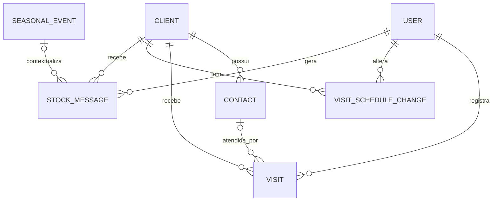

# ChokoCRM — Modelo de Dados

Este documento descreve o modelo de dados do ChokoCRM. Complementa a [especificação técnica](especificacao-tecnica.md), que prevalece em caso de divergência.

## 1. Visão geral

Este documento descreve o modelo de dados do ChokoCRM: o diagrama entidade-relacionamento (ER) das sete entidades persistidas e o dicionário de dados correspondente, campo a campo. Os nomes de entidades e campos aqui definidos são canônicos e serão implementados literalmente no `schema.prisma` da Etapa 2 (Fundação).

Duas classes de informação relevantes ao domínio **não são modeladas como entidade persistida** neste documento, por decisão explícita da especificação técnica:

- **Dados de venda e estoque**, obtidos sob demanda do ERP da Senior Sistemas por meio da interface `ErpProvider` (seção 4).
- **Cor do cliente**, calculada em tempo de consulta a partir do histórico de visitas (e, futuramente, de vendas) — nunca armazenada em coluna própria (seção 5).

## 2. Diagrama entidade-relacionamento



Leitura das cardinalidades:

- Um **User** (representante ou gestor) registra várias `Visit`, altera várias `VisitScheduleChange` e gera várias `StockMessage`; cada uma dessas ocorrências pertence a exatamente um usuário.
- Um **Client** possui vários `Contact`, recebe várias `Visit` e várias `StockMessage`, e tem várias `VisitScheduleChange`; cada uma dessas ocorrências pertence a exatamente um cliente.
- Um **Contact** pode ser atendido em zero ou várias `Visit` (campo `contact_id` opcional em `Visit` — nem toda visita identifica um contato específico); cada visita está associada a no máximo um contato.
- Um **SeasonalEvent** pode contextualizar zero ou várias `StockMessage` (campo `evento_sazonal` opcional em `StockMessage` — a mensagem pode ser gerada sem evento sazonal vigente); cada mensagem está associada a no máximo um evento sazonal.

As entidades do diagrama (em maiúsculas, convenção do Mermaid) correspondem uma a uma às entidades do dicionário de dados da seção 3: `USER` → `User`, `CLIENT` → `Client`, `CONTACT` → `Contact`, `VISIT` → `Visit`, `VISIT_SCHEDULE_CHANGE` → `VisitScheduleChange`, `STOCK_MESSAGE` → `StockMessage`, `SEASONAL_EVENT` → `SeasonalEvent`.

## 3. Dicionário de dados

Convenções adotadas nas tabelas abaixo:

- **Obrigatório = Sim** corresponde a uma restrição `NOT NULL`; **Obrigatório = Não** corresponde a uma coluna anulável.
- Campos sem indicação de opcionalidade na especificação (seção 5) são tratados como obrigatórios. Os campos explicitamente opcionais são `Visit.contact_id` e `StockMessage.evento_sazonal` (marcados com `?` na seção 5 da especificação), além de `Client.erp_id`, opcional conforme UC02 e UC11 (`docs/casos-de-uso.md`).
- Os tipos indicados são conceituais, para orientar o mapeamento no `schema.prisma` da Etapa 2; a escolha final de tipos nativos do PostgreSQL/Prisma (por exemplo, o tipo do identificador ou `text` vs. `varchar`) é decisão de implementação daquela etapa.
- Toda chave primária `id` é um identificador único; sugere-se UUID, por ser prática comum em aplicações Node/Prisma/PostgreSQL — a confirmação é decisão da Etapa 2.

### 3.1 User

| Campo | Tipo | Obrigatório | Descrição / Regra |
|---|---|---|---|
| id | Identificador único (UUID sugerido) | Sim | Chave primária. |
| nome | Texto | Sim | Nome completo do usuário. |
| email | Texto (único) | Sim | E-mail de login; identificador de autenticação. |
| senha_hash | Texto | Sim | Hash da senha de acesso; a senha em texto plano nunca é armazenada. |
| role | Enum: `REPRESENTANTE` \| `GESTOR` | Sim | Papel do usuário; define autorização (ex.: painel de indicadores e alertas gerenciais restritos a `GESTOR`, conforme seções 4.1 e 7 da especificação). |
| criado_em | Data/hora | Sim | Data e hora de criação do registro, preenchida automaticamente. |

### 3.2 Client

| Campo | Tipo | Obrigatório | Descrição / Regra |
|---|---|---|---|
| id | Identificador único (UUID sugerido) | Sim | Chave primária. |
| razao_social | Texto | Sim | Razão social da empresa cliente. |
| nome_fantasia | Texto | Sim | Nome fantasia da empresa cliente. |
| cnpj | Texto | Sim | CNPJ do cliente. |
| cidade | Texto | Sim | Cidade do estabelecimento do cliente. |
| endereco | Texto | Sim | Endereço completo do estabelecimento. |
| telefone | Texto | Sim | Telefone de contato principal do cliente; usado na geração do link de WhatsApp da mensagem de estoque (seção 6.3 da especificação). |
| email | Texto | Sim | E-mail de contato do cliente. |
| erp_id | Texto | Não | Identificador do cliente no ERP da Senior Sistemas; chave usada nas consultas ao `ErpProvider` (seção 4 deste documento). Preenchimento recomendado assim que disponível, mas opcional no cadastro — o cliente pode ainda não ter vínculo com o ERP (UC02, UC11 em `docs/casos-de-uso.md`). |
| recorrencia_dias | Número inteiro | Sim | Intervalo, em dias, entre visitas recorrentes a este cliente. **Valor padrão: 15. Faixa sugerida: 15 a 30.** Alteração exige registro correspondente em `VisitScheduleChange`, com justificativa (seção 6.2 da especificação). |
| ativo | Booleano | Sim | Indica se o cliente está ativo na carteira do representante. A especificação não define valor padrão explícito para este campo; sugere-se `true` na criação, como decisão de implementação da Etapa 2. |
| criado_em | Data/hora | Sim | Data e hora de criação do registro. |

### 3.3 Contact

| Campo | Tipo | Obrigatório | Descrição / Regra |
|---|---|---|---|
| id | Identificador único (UUID sugerido) | Sim | Chave primária. |
| client_id | Chave estrangeira → `Client.id` | Sim | Cliente ao qual o contato pertence. |
| nome | Texto | Sim | Nome do contato na empresa cliente. |
| cargo | Texto | Sim | Cargo/função do contato na empresa cliente. |
| telefone | Texto | Sim | Telefone do contato. |
| email | Texto | Sim | E-mail do contato. |
| principal | Booleano | Sim | Indica se este é o contato principal do cliente. **Regra: exatamente um contato principal por cliente.** A unicidade deve ser garantida na camada de aplicação (ao marcar um novo contato como principal, desmarcar o anterior, na mesma transação) e pode ser reforçada no banco por um índice único parcial sobre `client_id` restrito a `principal = true` — detalhamento da restrição é decisão de implementação da Etapa 2. |

### 3.4 Visit

| Campo | Tipo | Obrigatório | Descrição / Regra |
|---|---|---|---|
| id | Identificador único (UUID sugerido) | Sim | Chave primária. |
| client_id | Chave estrangeira → `Client.id` | Sim | Cliente visitado. |
| user_id | Chave estrangeira → `User.id` | Sim | Usuário (representante) que registrou a visita. |
| contact_id | Chave estrangeira → `Contact.id` | Não | Contato atendido na visita, quando identificado. Campo opcional — a visita pode ser registrada sem um contato específico. |
| data_hora | Data/hora | Sim | Data e hora em que a visita (check-in) ocorreu. |
| descricao | Texto | **Sim (NOT NULL)** | Relato da visita. **Campo obrigatório, com validação dupla (frontend e backend)** — requisito explícito da especificação (seção 5, observações, e seção 10, testes de integração). |
| houve_venda | Booleano | Sim | Indica se houve venda associada a esta visita. Utilizado no cálculo da cor do cliente (seção 5 deste documento). |

### 3.5 VisitScheduleChange

| Campo | Tipo | Obrigatório | Descrição / Regra |
|---|---|---|---|
| id | Identificador único (UUID sugerido) | Sim | Chave primária. |
| client_id | Chave estrangeira → `Client.id` | Sim | Cliente cuja recorrência de visita foi alterada. |
| user_id | Chave estrangeira → `User.id` | Sim | Usuário que realizou a alteração. |
| recorrencia_anterior | Número inteiro | Sim | Valor de `recorrencia_dias` vigente antes da alteração. |
| recorrencia_nova | Número inteiro | Sim | Novo valor de `recorrencia_dias` (faixa sugerida: 15 a 30 dias). |
| justificativa | Texto | **Sim (NOT NULL)** | Motivo da alteração da recorrência. **Campo obrigatório** — toda alteração de `recorrencia_dias` deve gerar um registro correspondente nesta entidade, com justificativa preenchida (requisito explícito da especificação, seção 5 e seção 6.2). |
| data | Data/hora | Sim | Data (e hora) em que a alteração foi realizada. |

### 3.6 StockMessage

| Campo | Tipo | Obrigatório | Descrição / Regra |
|---|---|---|---|
| id | Identificador único (UUID sugerido) | Sim | Chave primária. |
| client_id | Chave estrangeira → `Client.id` | Sim | Cliente destinatário da mensagem de consulta de estoque. |
| user_id | Chave estrangeira → `User.id` | Sim | Representante que gerou a mensagem. |
| evento_sazonal | Chave estrangeira → `SeasonalEvent.id` | Não | Evento sazonal vigente no momento da geração, usado para sugerir produtos no template. Campo opcional — pode não haver evento sazonal ativo. |
| texto_final | Texto | Sim | Texto final da mensagem, usado para compor o link `https://wa.me/<telefone>?text=<mensagem>` (seção 6.3 da especificação). |
| data_geracao | Data/hora | Sim | Data e hora de geração da mensagem; usada para auditoria e para o KPI de taxa de registro. |

### 3.7 SeasonalEvent

| Campo | Tipo | Obrigatório | Descrição / Regra |
|---|---|---|---|
| id | Identificador único (UUID sugerido) | Sim | Chave primária. |
| nome | Texto | Sim | Nome do evento ou data comemorativa (ex.: Páscoa, Dia das Mães, Dia dos Namorados, Dia dos Pais, Natal). |
| data_inicio | Data | Sim | Data de início do período de vigência do evento. |
| data_fim | Data | Sim | Data de término do período de vigência do evento. |
| produtos_sugeridos | Lista de texto | Sim | Lista de produtos sugeridos associados ao evento; utilizada na composição de templates de mensagem de estoque (seção 6.3) e no módulo de insights (seção 6.4 da especificação). |

## 4. Dados externos (ERP)

Dados de **venda e estoque não são persistidos** no banco de dados do ChokoCRM. Eles são obtidos sob demanda a partir do ERP da Senior Sistemas, por meio da interface `ErpProvider` (padrão Adapter, seção 4.3 da especificação):

```ts
interface ErpProvider {
  getLastSale(clientErpId: string): Promise<Sale | null>;
  getSales(clientErpId: string, period: Period): Promise<Sale[]>;
  getPurchaseVolume(clientErpId: string, period: Period): Promise<Volume>;
  getStockHistory(clientErpId: string): Promise<StockSnapshot[]>;
}
```

- A chave de consulta é `Client.erp_id` (seção 3.2), que identifica o cliente no ERP da Senior.
- Enquanto a API real da Senior não estiver disponível, a interface é implementada por `MockErpProvider`, com dados gerados por seed com sazonalidade realista (picos de venda antes de Páscoa, Dia das Mães, Dia dos Namorados, Dia dos Pais e Natal), servindo de base ao módulo de insights (seção 6.4 da especificação).
- A futura substituição por uma implementação real (`SeniorErpProvider`) troca apenas a classe que implementa `ErpProvider`; nenhuma outra camada do sistema (services, controllers, repositories, frontend) precisa ser alterada — este é exatamente o propósito do padrão Adapter adotado (seções 4.1 e 4.3 da especificação).
- Não havendo persistência local, `Sale`, `Period`, `Volume` e `StockSnapshot` são tipos de dados **de integração** (contrato do `ErpProvider`), e não entidades do banco de dados do ChokoCRM — por isso não constam do dicionário de dados da seção 3.

## 5. Cor do cliente

A cor do cliente é um indicador visual (badge exibido na lista de clientes e na ficha do cliente) que **não é armazenado em nenhuma entidade** — é **calculado em tempo de consulta**, a partir do histórico de visitas (`Visit`) do cliente. Essa decisão evita inconsistência de dados e a necessidade de jobs de sincronização (especificação, seção 5, observações).

O cálculo é avaliado nesta ordem — a primeira regra satisfeita determina a cor (especificação, seção 6.1):

| Ordem | Cor | Regra |
|---|---|---|
| 1 | 🔴 Vermelho | Mais de 30 dias sem visita. |
| 2 | 🟠 Laranja | Entre 15 e 30 dias sem visita. |
| 3 | 🟢 Verde | Última visita há até 15 dias, **com** venda (`Visit.houve_venda = true`). |
| 4 | 🟡 Amarelo | Última visita há até 15 dias, **sem** venda (`Visit.houve_venda = false`). |

Observações:

- "Dias sem visita" é contado a partir da data da `Visit.data_hora` mais recente do cliente (ou desde o cadastro do cliente, caso ainda não haja nenhuma visita registrada).
- O tratamento exato dos limites (exatamente 15 e exatamente 30 dias) é decisão de implementação da regra na Etapa 4, respeitando a ordem de avaliação acima, definida pela especificação (seção 6.1).
- Os limiares (15 e 30 dias) ficam centralizados na camada de configuração (`config/`, seção 4.2 da especificação), permitindo ajuste fino junto à empresa sem alteração do código de negócio.
- Na Etapa 5, a regra passa a ser composta: além do tempo sem visita, considera também a última venda retornada pelo `ErpProvider` (seção 4 deste documento) — por exemplo, um cliente visitado recentemente mas sem comprar há determinado período pode ser rebaixado de cor. Essa regra composta está fora do escopo desta Etapa 1 e será detalhada quando a integração com o ERP for implementada.
